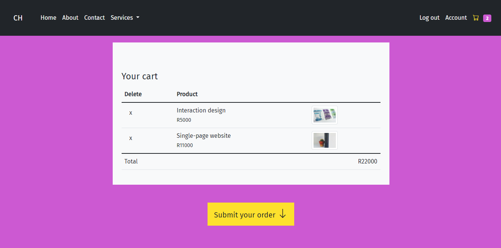
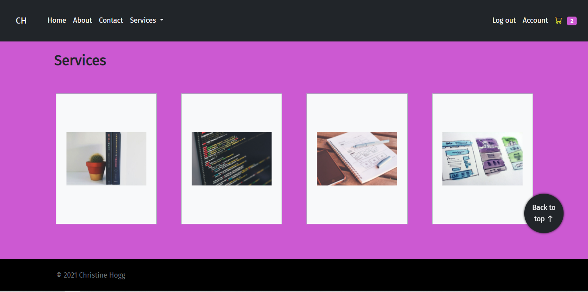

## Fullstack Online Store Project (CodeSpace)

This is my final project for a fullstack web develoment course I completed with CodeSpace. The task was to create our own API for the backend to communicate with a MySQL Database storing the products, and a frontend shop page using HTML, CSS and JavaScript. I decided to create a store that also functions as my web development portfolio, allowing users to add services to a cart and place an order. To make API requests from the frontend, I used the JavaScript Fetch API method to display cart data, categories and products, as well as add order and email messages to the database when the user submits a form on the frontend. I used SASS and CSS to design the look and feel of the website. On the homepage users are able to click on items on my portfolio and a JavaScript modal will open with more information about the projects I completed throughout the course. 

### Requirements:
* seperate backend and frontend
* object-oriented programming

### Design
* responsive across mobile, tablet, and desktop
* homepage with a banner/hero/background image, and featured product section
* about page with optimised images 
* a working contact form that adds sanitised entries to a MySQL database
* a back-to-top button

### Frontend
* a storefront page as well as individual product pages
* the user is able to click on an "Add to cart" button for each product
* the user is able to remove items from the cart
* a basket displaying the number of products added to the basket, description, and the total cost

### Backend
* API endpoints for all data that is pulled into the database and needed to be displayed on frontend
* relevant user data is pulled in from the database when they are logged in and displayed on their profile page
* data on the server is stored securely and persists between user logouts
* a well-organised database

### How to run the project
To run the project locally, download the entire repository from GitHub and open the API (backend) using MAMP, and run the frontend with Live Server in Visual Studio Code. I have also included a MySQL file named "webstore_portfolio" in the "api-for-shop" folder which needs to be uploaded through phpMyAdmin to connect to the database locally. To test the cart functionality, sign up and then log in with your details. 

